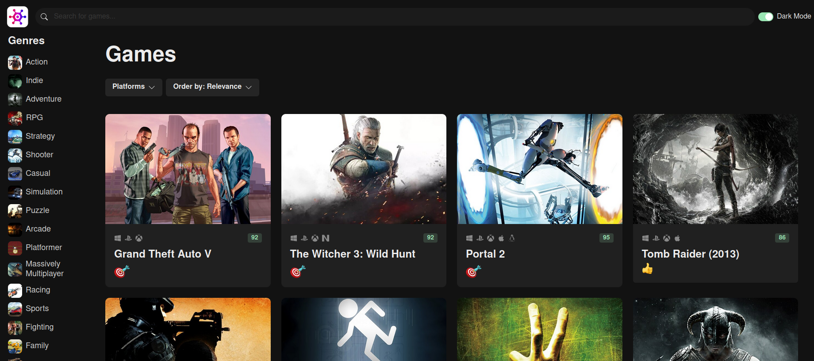

# Game Hub

Live URL: https://game-gvid6jduc-gef3233-gmailcom.vercel.app/

This is the complete source code for these courses: https://codewithmosh.com/p/ultimate-react-part1 and https://codewithmosh.com/p/ultimate-react-part2

The API consumed is [RAWG](https://rawg.io/)

I would encourage anyone that wants to learn React to do it, it really goes step by step and explains key concepts in a very easy to understand way.

This program is licensed under Creative commons Attribution 3.0 Unported, more info : http://creativecommons.org/licenses/by/3.0/deed.en_US
